# Interoperability

# not APIs

_The capability of a system to interact and function with others._

---

## Roll back, roll forward

1. Prior art using APIs
2. The foundations of APIs
3. New solutions to interoperability

---

## Interfacing with my bank

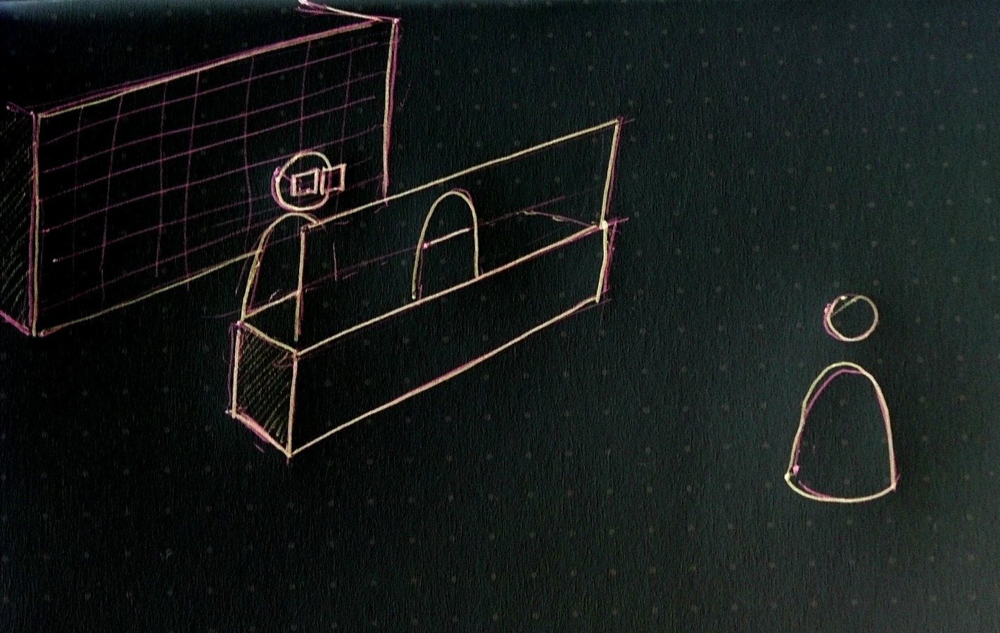

???

## What is an api?

An interface between two parties ... here the interface is that little window which you can ask questions through.
e.g. Can I have my statements, open a new account.

Some requests you might make are "not legal" e.g. give me all the money

---

## (Robot) Interfacing with my bank

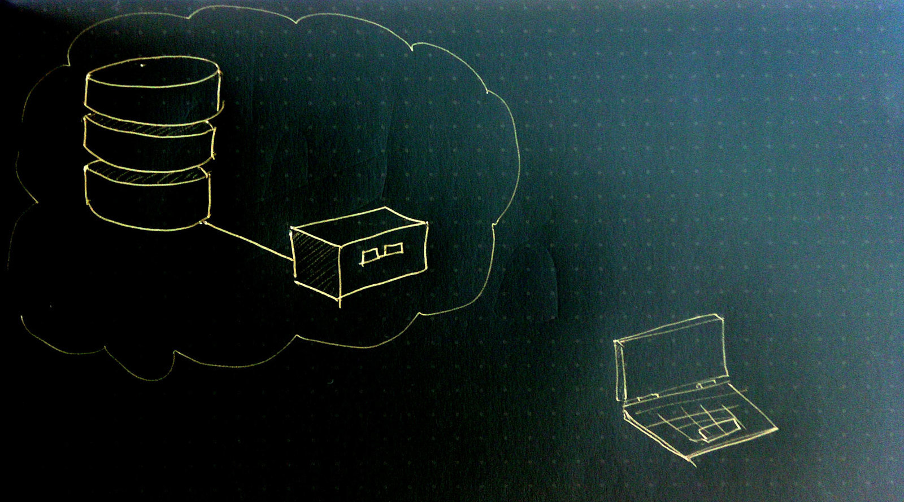

???

A digital version of the same thing is played out with robots.
If we can program the robots to interface, we have a programmeable interface.

e.g. Kiwibank has a server my phone talks to, then displays results

---

## Better interfaces!

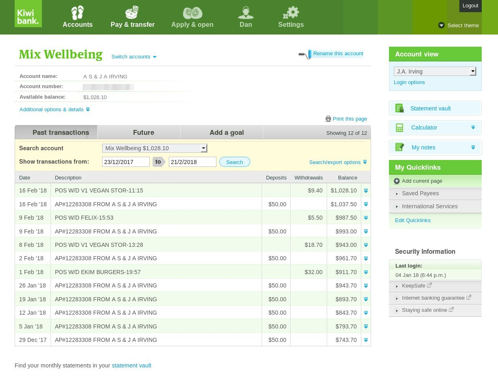

???

here's my boring bank account page. I'm try to get a sense of how I'm managing my wellbeing spending

---

## Hooray accessibility!

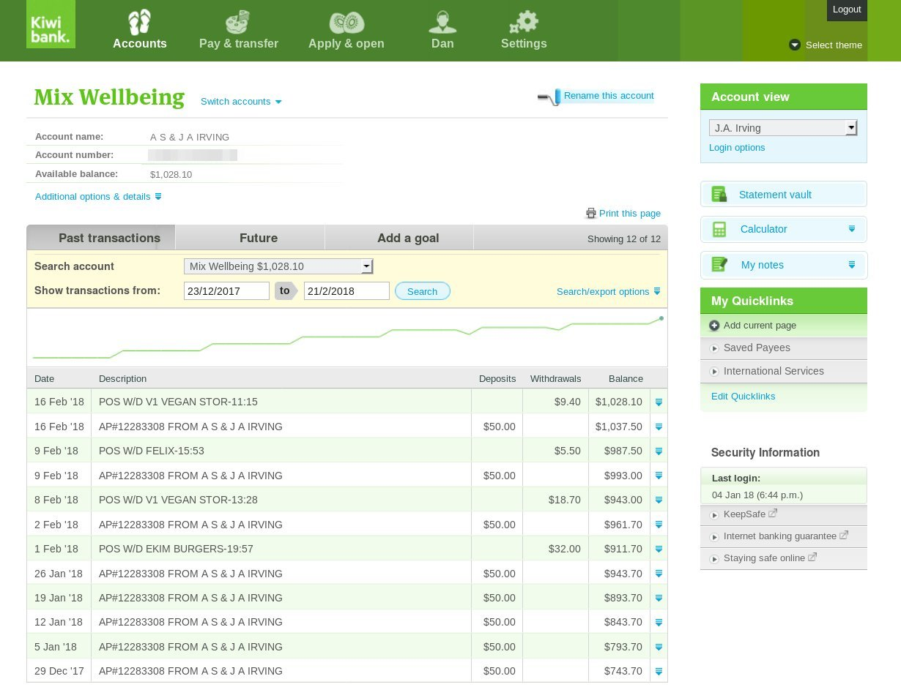

???

If Kiwibank had an API that was open to customers, I could easily build something like this.
I did build something like this, and made it a free tool. But it's crappier than it needs to be

---

## Dream bigger

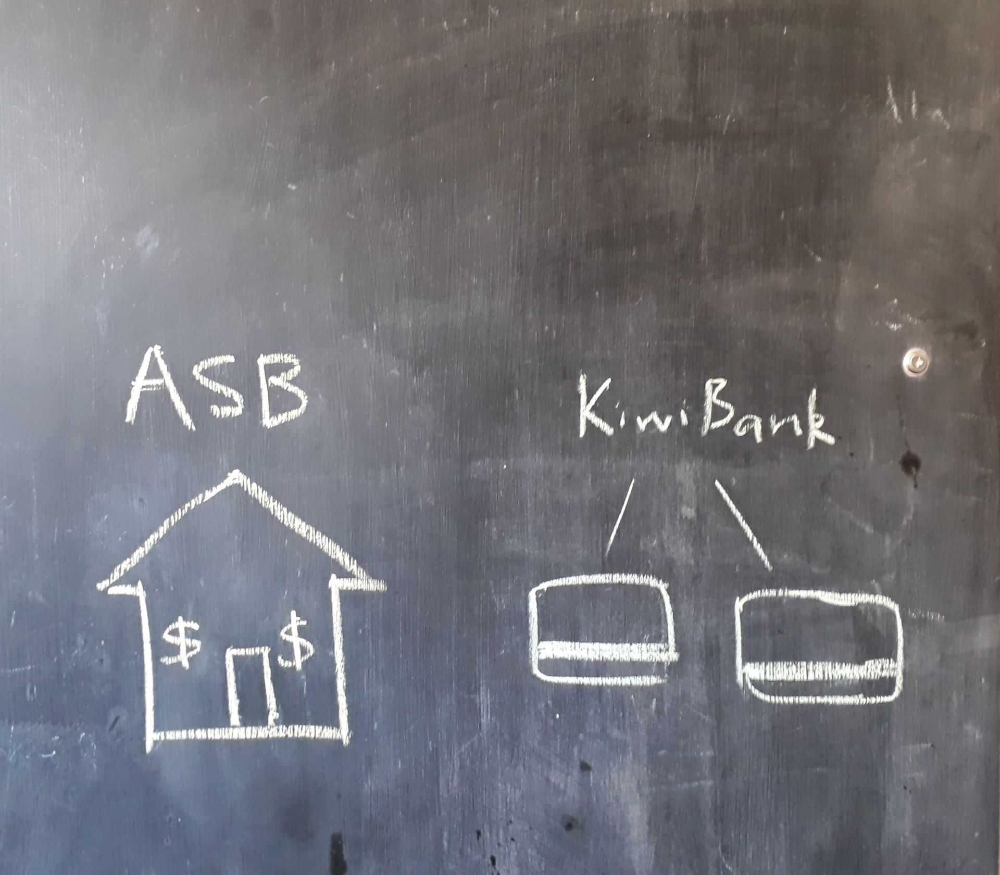

???

I don't care about bank account though, I care about stability, and building a more awesome future. LET ME DO IT

---

## Interoperable

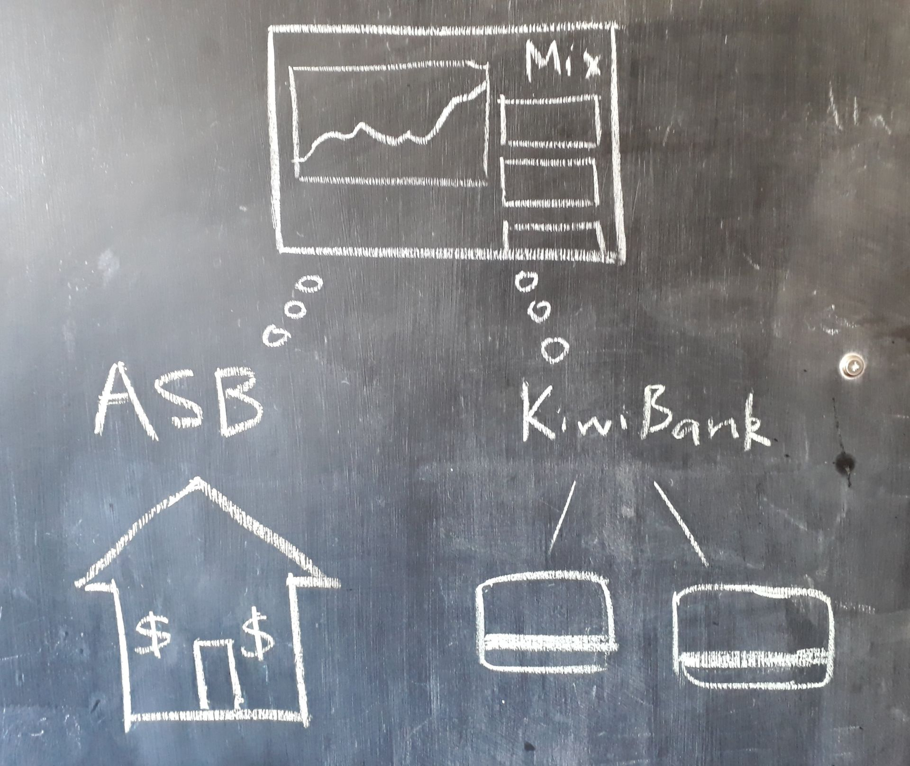

???

I could see bigger trends, understand my context more.
Coordinate mundane details easily.

---

## The Problem

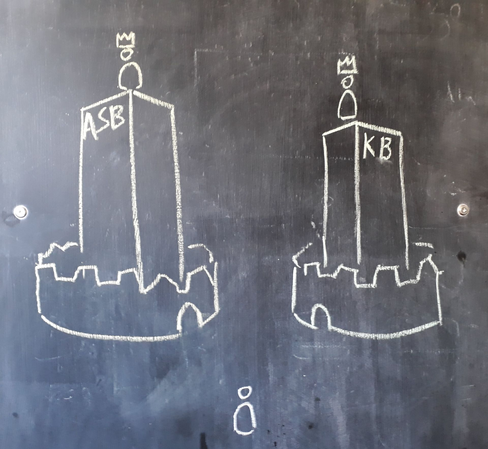

???

- No APIs
- wrong incentives
- even with APIs building interoperability is a pain in the arse

---

## Filing cabinets

???

As long as filing cabinets exist, we're predisposed to hoarding and then having to try and build interfaces.

One major problem is dealing with duplication of data... 
e.g. identity - which is the Actual Me ... when there are copies of data about me held by multiple parties

---

## Content bound to a location

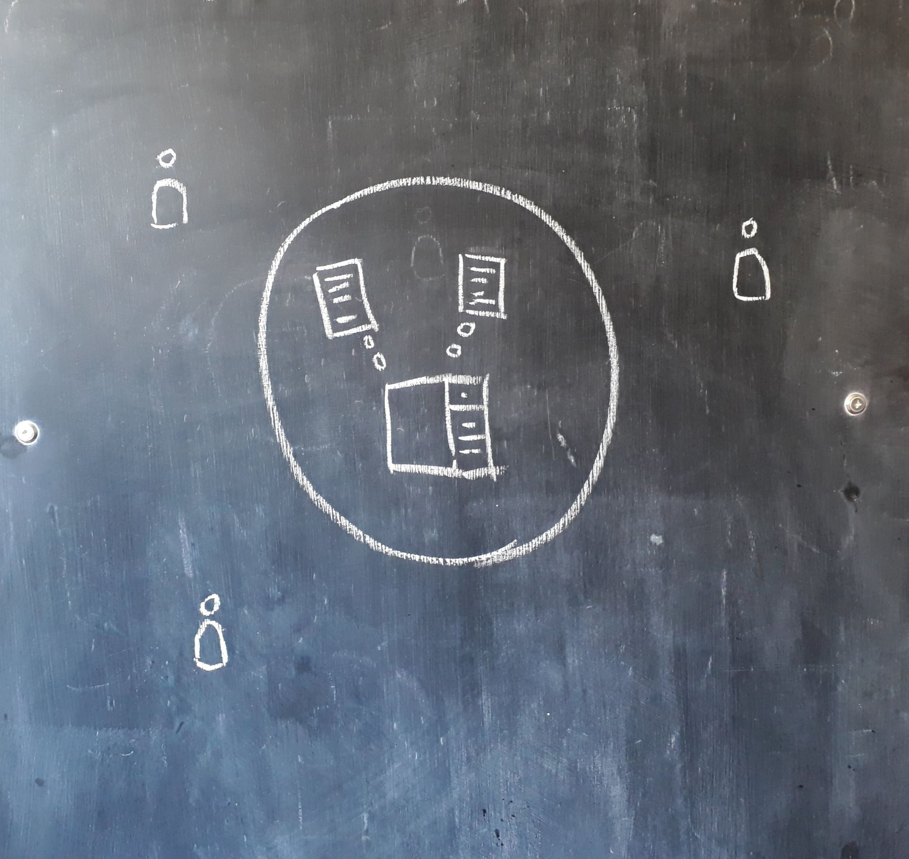

---

## Content-centric

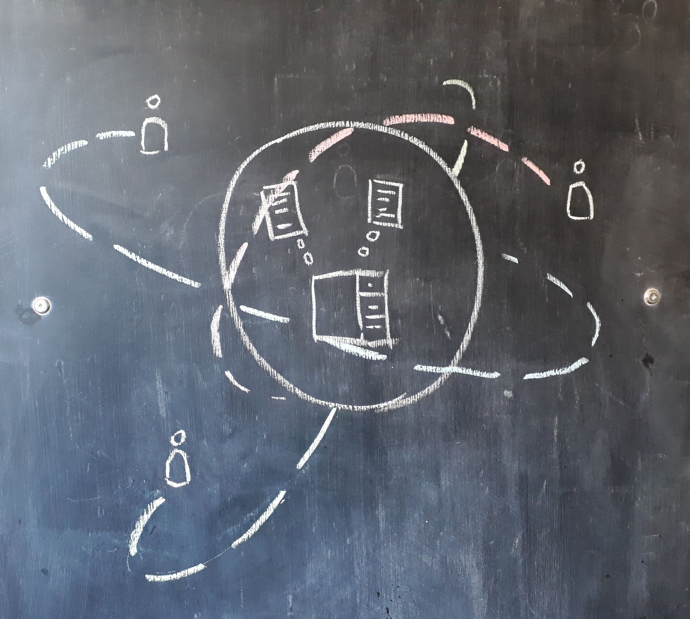

---

## Content in multiple locations

---

## Navigating a range of filing cabinets

User Journeys: e.g. "applying for superannuation", "applying for student allowance"

Look forward to: siloing, resolving duplication data, debating formats, complex authorisation

---

## _Content-centric_ pattern emerges from the assumption:

> # Data is bound to location

You have to go to a place to read / write some data

???

What if it was different?

---

## Rumpelstiltskin & the magic of _True Names_

- People : _public-private key cryptography_
- Objects : _hashing algorithms_

???

We don't need to be dependent on locations.

You might not know this but Rumpelstiltskin is a parable about key security.
By knowing Rumpelstiltskin's True Name, the princes has power over him (the contract they wrote together)

There's another common trope in fantasy writing about True Names, where if you know the True Name of a thing, you can call it to you.
Turns out this also exists (thanks cryptography!)

---

## I declare I'm applying for Superannuation

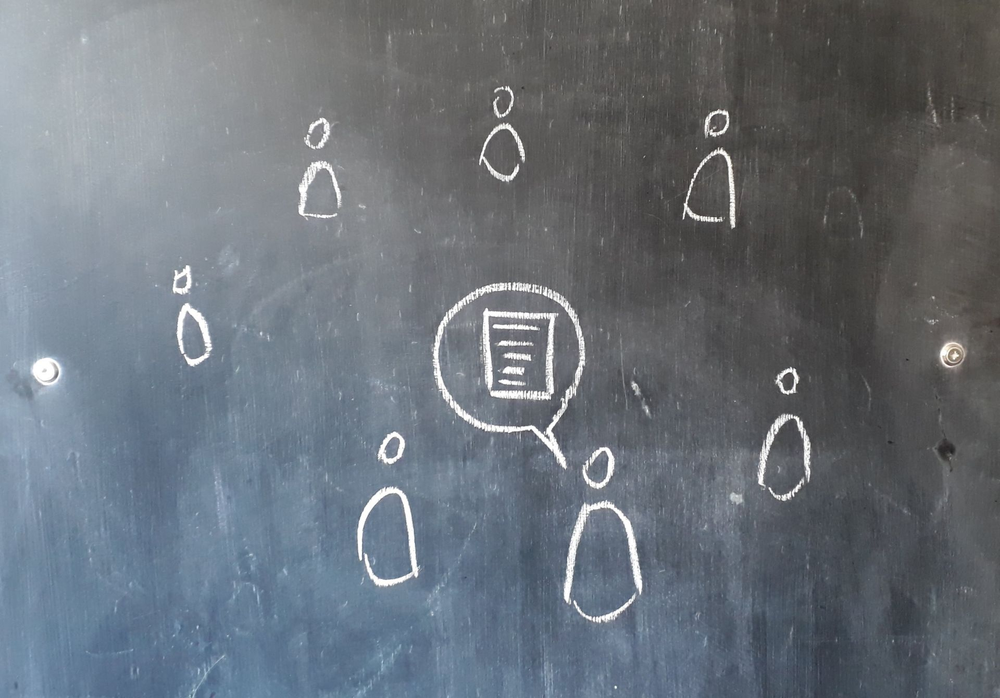

---

## WINZ is listening and responds

Note no filing cabinets, just a conversation with True Names

---

## .

---

## .

---

## .

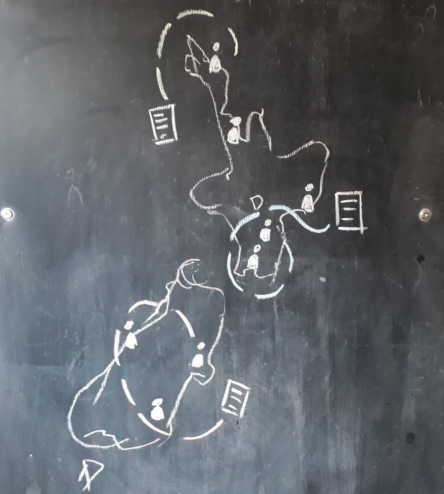

---

